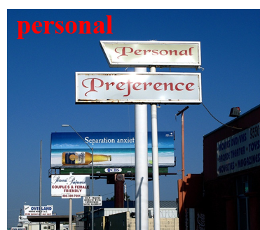
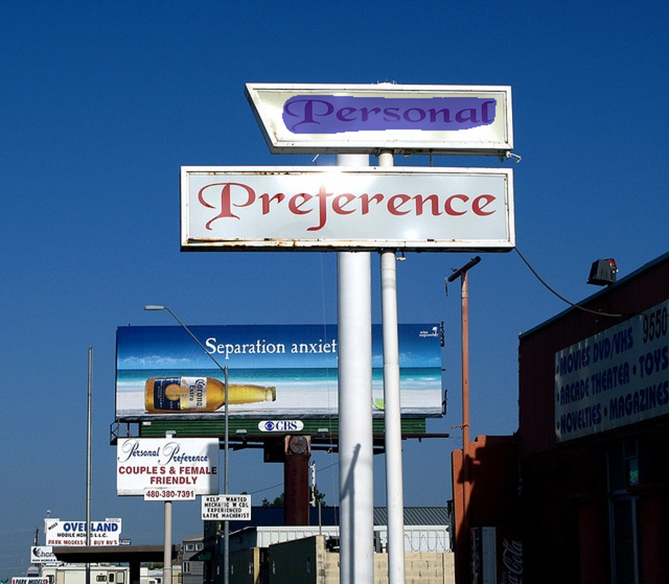
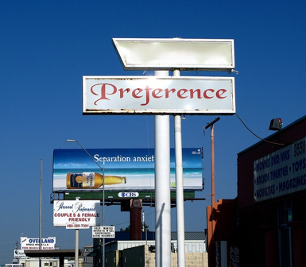
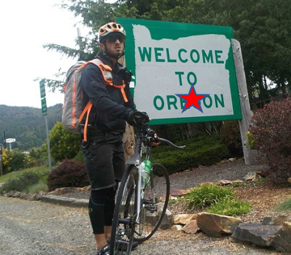

# Promptable Selective Scene Text Removal

---

## Project Links
| Paper | Code |
|:---:|:---:|
| [Paper](https://www.sciencedirect.com/science/article/pii/S0031320326011015) | [Code](https://github.com/PAradoxLG/Promptable-Selective-Scene-Text-Removal)| [Bibtex](https://github.com/PAradoxLG/Promptable-Selective-Scene-Text-Removal#citation) |---

## Description
This is the official implementation of the paper:  
**"Promptable Selective Scene Text Removal"**

We define a new STR task, called Promptable Selective Scene Text Removal (PSSTR), which can remove specific text in images with flexible prompts. Benchmark STR datasets are re-annotated with five different prompts for PSSTR. To our best knowledge, this is the first initiative to remove user-indicated text with different prompts, thereby defining a challenging yet promising task. We propose an end-to-end PSSTR model, integrating the Segment Anything Model (SAM) and a dual-branch text removal decoder. They are fused and trained in an interactive mode, which could cooperatively and simultaneously update text localization and 
text removal results. This work provides a strong baseline for the PSSTR task.

### Visual Results
> Examples of prompt removal on different scenarios

| Prompt | Input Image | Segmentation Mask | Output Image |
|:---:|:---:|:---:|:---:|
| Text |  |   |  |
| Point |  |  |  |

---

## Inference
Our model supports prompt-based text segmentation and prompt-based text erasure two inference modes. All inference scripts and core parameters are shown below.
1. Prompt-based Segmentation Inference
Run promptable selective scene text segmentation with optional feature visualization.
```Code
python .\demo_promptable.py --promptable --input datasets\xxx.jpg --visual
```
- --promptable: Required. The core flag for our framework. All segmentation and erasure tasks only support prompt-based mode, this parameter must be specified.
- --visual: Optional. Enable feature visualization during inference, disable by default.
2. Prompt-based Text Erasure Inference
Run promptable selective scene text erasure task.
```Code
python .\demo_erase.py --promptable --erase_mode --input datasets\xxx.jpg
```
- --promptable: Required. Mandatory parameter for prompt-based inference, must be added for all tasks.
- --erase_mode: Required. Switch model to text erasure working mode.

## Citation
```BibTeX
@article{LI2026114136,
title = {Promptable Selective Scene Text Removal},
journal = {Pattern Recognition},
volume = {180},
pages = {114136},
year = {2026},
issn = {0031-3203},
doi = {https://doi.org/10.1016/j.patcog.2026.114136},
url = {https://www.sciencedirect.com/science/article/pii/S0031320326011015},
author = {Guan Li and Anna Zhu and Ran Gong and Seiichi Uchida},
keywords = {Scene text segmentation, Scene text removal, Segment anything model, Text prompt, CLIP alignment},
abstract = {Scene Text Removal (STR) aims to remove the text instances in an image and replace them with a suitable background. However, most current STR models remove all scene text and cannot be adapted to only user-indicated text. In this paper, we introduce a novel task named Promptable Selective Scene Text Removal (PSSTR) that utilizes different types of flexible prompts, including points, scribbles, bounding boxes, rough or intricate text segmentation masks, words, and combinations thereof, to identify text areas and generate results that remove the specified text in images. Meanwhile, we propose an end-to-end STR network, building upon the powerful Segment Anything Model (SAM) to provide a strong baseline for PSSTR. Since SAM has only the ability to segment instances, a dual-branch text removal decoder is proposed and integrated with the SAM decoder to generate the results of text removal as well as text segmentation. SAM has no awareness of text instance semantics; thus, it cannot handle the input of the text prompt. To tackle this, we adopt a pre-trained text encoder, aligning the linguistic and the corresponding visual structural features of text, and fuse it with SAM through a parameter-efficient fine-tuning way. Additionally, we enrich the label data of the Flickr-ST dataset at the word level. Extensive experiments are conducted on it and other STR benchmarks, and the results demonstrate that our model performs effectively across all types of visual and linguistic prompts and surpasses other state-of-the-art STR methods.}
}
```
